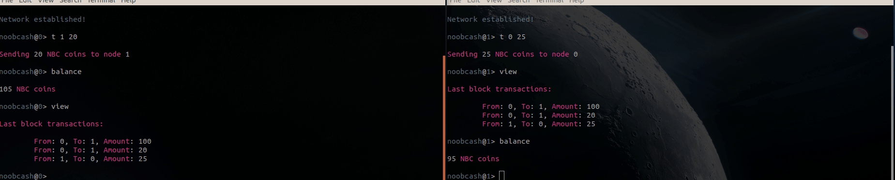

# Noobcash

This repo hosts the code of the blockchain-based project of [Georgios Vidalakis](https://github.com/georgevidalakis) and [Georgios Chochlakis](https://github.com/gchochla) created for the [Distributed Systems](http://www.cslab.ece.ntua.gr/courses/distrib/assign.go) 2019-20 course at National Technical University of Athens, school of Electrical and Computer Engineering.

## Blockchain

Blockchain is the technology behind most cryptocurrencies and in reality consists a distributed database that allows users to make secure transactions, without the need of central authority.

## Noobcash Infrastructure

Noobcash utilizes Proof-Of-Work for consensus. The assumptions needed to operate such a network are that the number of nodes is known a priori and a "bootstrap" node is responsible for its initialization. After all nodes have contacted the "bootstrap", they are bestowed an initial fund to transact and, thereafter, the network becomes purely p2p. The currency in the Noobcash ecosystem is the NooBCash coin (NBC) and comes into integer quanta.

## Usage

To setup a Noobcash network, one has to [install](./docs/installation.md) the project locally. Afterwards, the high-level way to initialize is to properly use `cli.py`.

```console
$ python cli.py -h

usage: cli.py [-h] [-p PORT] [-b] [-c CAPACITY] [-n NODES] [-d DIFFICULTY]
              [-a BOOTSTRAP_ADDRESS] [-s SCRIPT]

optional arguments:
  -h, --help            show this help message and exit
  -p PORT, --port PORT  port to listen on
  -b, --bootstrap       whether this node is bootstrap
  -c CAPACITY, --capacity CAPACITY
                        number of transactions in a block
  -n NODES, --nodes NODES
                        number of nodes in the network
  -d DIFFICULTY, --difficulty DIFFICULTY
                        difficulty of mining
  -a BOOTSTRAP_ADDRESS, --bootstrap_address BOOTSTRAP_ADDRESS
                        Bootstrap's ip+port
  -s SCRIPT, --script SCRIPT
                        filename of transactions to execute
```

NOTE that the bootstrap should be the one initialized first. After starting every node, one should be able to access the Noobcash shell (CLI):

```console
noobcash@0> help

This is the NOOBCASH command line interface.

To launch shell, execute cli.py [-h] [-p PORT] [-b] [-c CAPACITY] [-n NODES] [-d DIFFICULTY]
                                [-a BOOTSTRAP_ADDRESS] [-s SCRIPT]

optional arguments:
  -h, --help            show part of this help message
                        and exit
  -p PORT, --port PORT  port to listen on
  -b, --bootstrap       whether this node is bootstrap
  -c CAPACITY, --capacity CAPACITY
                        number of transactions in a block
  -n NODES, --nodes NODES
                        number of nodes in the network
  -d DIFFICULTY, --difficulty DIFFICULTY
                        difficulty of mining
  -a BOOTSTRAP_ADDRESS, --bootstrap_address BOOTSTRAP_ADDRESS
                        Bootstrap's ip+port
  -s SCRIPT, --script SCRIPT
                        filename of transactions to execute

While using the shell, use following commands:
  help                  show this help message
  view                  show all transactions in the last
                        validated block of blockchain
  view_blockchain       show all transactions in the
                        current blockchain
  balance               show current balance
  balances              show balances of all nodes as
                        reflected in blockchain  
  t RECIPIENT_ID AMOUNT send AMOUNT noobcash coins to
                        RECIPIENT_ID node
  exit                  gracefully exit shell

```

A demo of creating a transaction:


